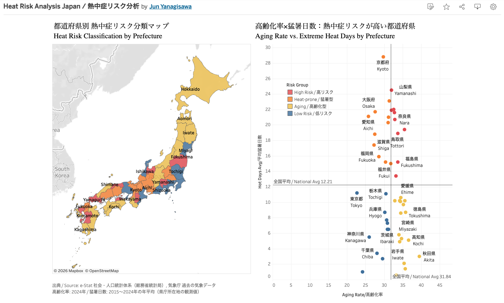
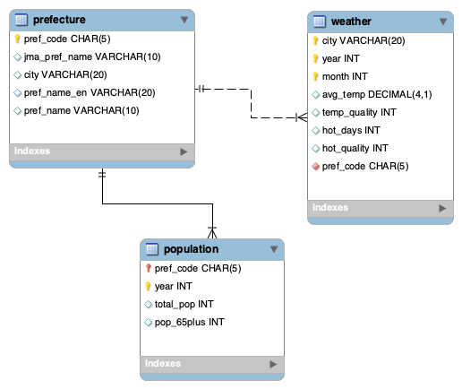

# Heat Risk Analysis Japan / 熱中症リスク分析

**Which prefectures are both aging fast and getting extremely hot?**
**高齢化が進み、しかも猛暑日が多いのはどの都道府県か？**

🔗 **Interactive dashboard / ダッシュボード:**
[Tableau Public – Heat Risk Analysis Japan](https://public.tableau.com/views/HeatRiskAnalysisJapan/HeatRiskAnalysisJapan)

[](https://public.tableau.com/views/HeatRiskAnalysisJapan/HeatRiskAnalysisJapan)

*Click the image to explore the interactive version. / 画像をクリックすると操作できるダッシュボードが開きます。*

---

## Overview / 概要

Older adults are the group most vulnerable to heatstroke. This project combines Japanese government population data with Japan Meteorological Agency (JMA) weather records to identify prefectures where **a high share of older residents overlaps with frequent extremely hot days (35°C+)**, in order to suggest where heat-safety measures should be prioritized.

高齢者は熱中症のリスクが最も高い層です。本プロジェクトでは、政府統計（e-Stat）の人口データと気象庁の観測データを組み合わせ、**高齢化率が高く、かつ猛暑日（最高気温35℃以上）が多い都道府県**を特定し、熱中症対策を優先すべき地域を提案します。

## Tools / 使用ツール

| Stage | Tool |
|---|---|
| Data collection / データ収集 | e-Stat, JMA website |
| Storage, cleaning, transformation, analysis / 保存・加工・分析 | MySQL 8.0, MySQL Workbench |
| Data modeling / データ設計 | MySQL Workbench (EER diagram) |
| Visualization / 可視化 | Tableau Public |

All data processing was done **in SQL only** — including reshaping the wide-format weather file.
データ加工はすべて**SQLのみ**で行いました（横長の気象データの変換を含む）。

## Data Sources / データ出典

| Data | Source | Period |
|---|---|---|
| Total population, population aged 65+ / 総人口・65歳以上人口 | e-Stat 社会・人口統計体系（総務省統計局）A1101, A1303 | 2015–2024 |
| Monthly mean temperature, days with max temp ≥35°C / 月平均気温・猛暑日数 | 気象庁 過去の気象データ（47 prefectural capitals / 県庁所在地） | 2015-01 – 2024-12 |

## Data Model / データモデル



- **prefecture** — master table (1 row per prefecture): Japanese/English names, JMA name, observation city
- **population** — 470 rows (47 prefectures × 10 years), PK `(pref_code, year)`
- **weather** — 5,640 rows (47 cities × 120 months), PK `(city, year, month)`

Both fact tables join to the master through `pref_code`. Duplicated name columns were removed during normalization, so names live in one place only.
2つのデータは `pref_code` でマスタにつながり、名前は正規化によりマスタだけに持たせています。

## Pipeline / 処理の流れ

| File | What it does / 内容 |
|---|---|
| `sql/01_create_database.sql` | Create the database / データベース作成 |
| `sql/02_load_population.sql` | Load e-Stat CSV, convert codes (`2024100000` → `2024`, `1000` → `01000`) |
| `sql/03_load_weather.sql` | Load JMA CSV and **unpivot 284 columns → long format using SQL only** |
| `sql/04_eda.sql` | Exploratory analysis: top 10 aging rate / hot days |
| `sql/05_prefecture_master.sql` | Build master table, English names, normalization, foreign keys |
| `sql/06_pref_year_summary.sql` | Prefecture × year analysis table → `pref_year_summary.csv` |
| `sql/07_risk_analysis.sql` | 4-group risk classification → `pref_risk.csv` (Tableau) |

## Method / 分析方法

- **Aging rate / 高齢化率:** population 65+ ÷ total population, **2024** (the latest population structure)
- **Hot days / 猛暑日数:** days with a maximum temperature of 35°C or higher per year, **averaged over 2015–2024** to smooth out unusually hot or cool years
- **Classification / 分類:** each prefecture is compared with the **mean of all 47 prefectures** (aging rate 31.8%, hot days 12.2 per year)

| | Hot days ≥ avg | Hot days < avg |
|---|---|---|
| **Aging ≥ avg** | 🔴 High Risk / 高リスク | 🟡 Aging / 高齢化型 |
| **Aging < avg** | 🟠 Heat-prone / 猛暑型 | 🔵 Low Risk / 低リスク |

## Key Findings / 主な発見

1. **9 prefectures are High Risk:** Yamanashi, Kumamoto, Saga, Kagawa, Nara, Yamaguchi, Tottori, Fukushima and Toyama.
   高リスクは山梨・熊本・佐賀・香川・奈良・山口・鳥取・福島・富山の9県。
2. **Yamanashi stands out** with the most hot days in the group (24.5 days/year) and an aging rate of 32.0%. Its capital, Kofu, sits in a basin where heat builds up in summer.
   山梨は高リスクの中で猛暑日が最多（年24.5日）。甲府は熱がこもりやすい盆地に位置する。
3. **The hottest places are not always the riskiest.** Kyoto has the most hot days nationwide (28.8/year), and Osaka and Aichi are also hot, but their aging rates are below average, so they fall into the Heat-prone group.
   **最も暑い地域が最もリスクが高いとは限らない。** 京都は猛暑日が全国最多（年28.8日）だが、高齢化率が平均以下のため「猛暑型」。
4. **Northern Japan is aging but cool** (Hokkaido, Tohoku), while the **Tokyo area is below average on both**.
   北日本は高齢化が進むが猛暑日は少なく、首都圏はどちらも平均以下。

Looking at heat alone would miss prefectures such as Yamanashi, Fukushima and Toyama, where heat and aging overlap.
暑さだけを見ると、山梨・福島・富山のように「暑さと高齢化が重なる地域」を見落としてしまう。

## Recommendations / 提言：自治体・政府が取るべき行動

The four groups call for different actions. Instead of applying the same heat measures everywhere, resources can be focused where heat and aging overlap.
4つのグループでは、取るべき対策が異なります。全国一律ではなく、**暑さと高齢化が重なる地域に資源を集中**させることで、限られた予算でも効果を高められます。

| Group / 分類 | What the data shows / データからわかること | Recommended actions / 取るべき行動 |
|---|---|---|
| 🔴 **High Risk / 高リスク**<br>Yamanashi, Kumamoto, Saga, Kagawa, Nara, Yamaguchi, Tottori, Fukushima, Toyama | Many older residents **and** frequent 35°C+ days<br>高齢者が多く、猛暑日も多い | **Top priority. Protect older residents directly.**<br>・Set up cooling shelters (クーリングシェルター) within walking distance of older residents<br>・Check on older people living alone by phone or visit when heat alerts are issued (民生委員・地域包括支援センターとの連携)<br>・Support air-conditioner purchase and electricity costs for low-income older households<br>**最優先。高齢者を直接守る対策を。** 歩いて行ける距離のクーリングシェルター整備、熱中症アラート発令時の一人暮らし高齢者への声かけ・訪問、低所得の高齢世帯へのエアコン購入・電気代の支援 |
| 🟠 **Heat-prone / 猛暑型**<br>Kyoto, Osaka, Aichi, Gifu, Saitama, etc. | Very hot, but a younger population<br>暑いが、比較的若い | **Heat measures for everyone, and prepare for aging.**<br>・Reduce urban heat with shade, trees and cool pavements<br>・Strengthen heat rules for outdoor work, schools and events<br>・Monitor closely: as these areas age, they will move into the High Risk group<br>**住民全体への暑さ対策と、高齢化への備えを。** 日陰・緑化などの都市の暑さ対策、屋外労働・学校・イベントでの熱中症対策の強化。高齢化が進めば高リスクに移るため、重点的に見守る |
| 🟡 **Aging / 高齢化型**<br>Hokkaido, Tohoku, Shikoku, etc. | Older population, but few hot days<br>高齢化は進むが、猛暑日は少ない | **Prepare for rare but dangerous heat waves.**<br>・Residents are not used to extreme heat, and homes may lack air conditioning<br>・Run awareness campaigns before summer and have emergency plans ready for sudden heat waves<br>**まれな猛暑への備えを。** 暑さに慣れておらず、エアコンのない家庭もあるため、夏前の啓発と、急な猛暑時の緊急対応計画を用意しておく |
| 🔵 **Low Risk / 低リスク**<br>Tokyo, Kanagawa, Chiba, etc. | Below average on both<br>どちらも平均以下 | **Maintain current measures.** Low risk does not mean no risk: the number of older people is still large in big cities.<br>**現状の対策を維持。** 大都市は割合が低くても高齢者の「人数」は多いため、油断は禁物 |

**For the national government / 国に向けて**
- **Allocate heat-safety funding by risk, not equally.** Using an index that combines aging and heat, like this one, can guide where subsidies for cooling shelters and elderly support should go first.
  **補助金はリスクに応じて配分を。** 高齢化と暑さを組み合わせた指標を使えば、クーリングシェルターや高齢者支援の予算をどこに優先すべきか判断できる。
- **Update the classification every year.** Aging and climate both change, so the High Risk list will change too. Re-running this pipeline with new data takes only minutes.
  **分類は毎年更新を。** 高齢化も気候も変わるため、高リスク県も変わる。本プロジェクトの処理は、新しいデータで数分で再実行できる。

## Limitations / 分析の限界

- **One city represents each prefecture.** Weather comes from the JMA station in the prefectural capital, so differences between mountains and cities within a prefecture are not captured.
  県庁所在地の観測値で県全体を代表しているため、県内の地域差は反映されていない。
- **The average is a hard cutoff.** Prefectures near the line (e.g., Toyama at 13.4 days) could switch groups with small changes.
  平均で区切っているため、基準付近の県（例：富山 13.4日）はわずかな差で分類が変わりうる。
- **Risk is a proxy.** Actual heatstroke cases, air-conditioner use and humidity are not included.
  実際の熱中症搬送者数、エアコン普及率、湿度などは含まれていない。
- **Data quality:** 20 of 5,640 monthly records had JMA quality flag 5 ("quasi-normal": a few days missing within tolerance) and were kept.
  5,640件中20件が品質情報5（準正常）だったが、許容範囲内として使用。

## Challenges & Solutions / 苦労した点と解決方法

| Challenge | Solution |
|---|---|
| Japanese text garbled on import (Shift_JIS vs UTF-8) / 文字化け | Downloaded UTF-8 (no BOM), set `CHARACTER SET` in `LOAD DATA` |
| Workbench Import Wizard crashed on Japanese text (Mac) / ウィザードの不具合 | Switched to `LOAD DATA LOCAL INFILE` |
| JMA file had 47 stations side by side (284 columns) / 横長データ | Loaded each line as text, then **unpivoted with `SUBSTRING_INDEX` + `CROSS JOIN`** on a station index table |
| Prefecture names differed between sources (`東京都` vs `東京`, `北海道` vs `石狩`) / 名前の不一致 | Built a **prefecture master table** and joined everything by `pref_code` |
| Tableau average lines moved when a prefecture was selected / 平均線が動く | Used a **highlight** action instead of a filter and turned off recalculated reference lines |

## Repository Structure / 構成

```
heat-risk-analysis/
├── README.md
├── sql/            # 01–07, run in order / 番号順に実行
├── data/           # pref_year_summary.csv, pref_risk.csv
└── image/          # dashboard.png, heat_risk_erd.png
```
